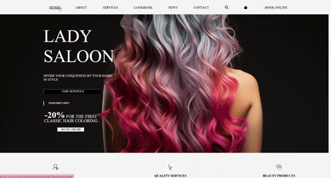

<!-- ### Hi there 👋

<!--
**Panchita1989/Panchita1989** is a ✨ _special_ ✨ repository because its `README.md` (this file) appears on your GitHub profile.

Here are some ideas to get you started:

- 🔭 I’m currently working on ...
- 🌱 I’m currently learning ...
- 👯 I’m looking to collaborate on ...
- 🤔 I’m looking for help with ...
- 💬 Ask me about ...
- 📫 How to reach me: ...
- 😄 Pronouns: ...
- ⚡ Fun fact: ...
-->

<h1 align="center">Hi 👋, I'm Franciska</h1>
<h3 align="center">A passionate fullstack developer from Switzerland living in Mexico</h3>

- 👨‍💻 All of my projects are available at [https://github.com/Panchita1989](https://github.com/Panchita1989)

<h1 align="center">Projects</h1>

<table bordercolor="#66b2b2" align="center" width="90%">

 <tr>
   <td  width="50%" valign="top">
   <h3 align="center">Tigre Bacalar</h3>
    
   
    
    

   
     

   
Oficial Website of Tigre Bacalar

  </td>
  <td  width="50%" valign="top">
   <h3 align="center">Portfolio</h3>
    
   
    
    

   
     

   
Portfolio Franciska Landwehr

  </td>
   </tr>
  <tr>
   <td  width="50%" valign="top">
   <h3 align="center">Lady Saloon</h3>
    
     
    
    

   
     

   
Landing Page for a Hair Saloon

  </td>
 </tr>
 </table>

<h3 align="center">Connect with me:</h3>

<h3 align="center">Languages and Tools:</h3>

   

